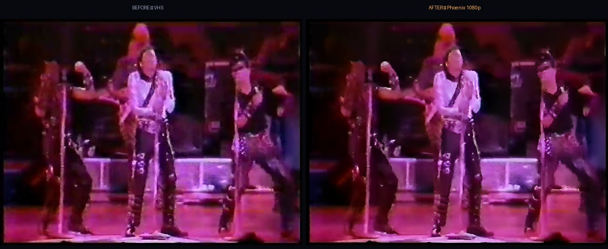
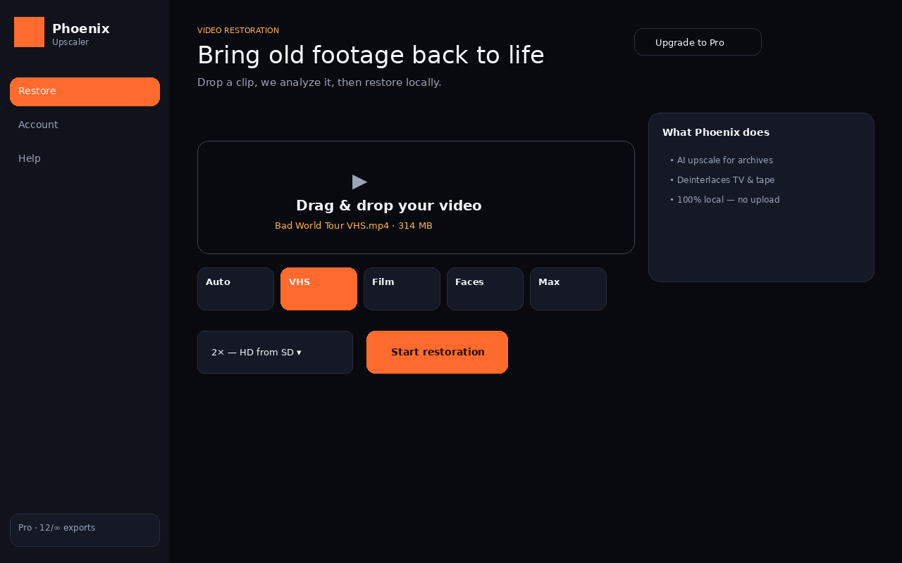
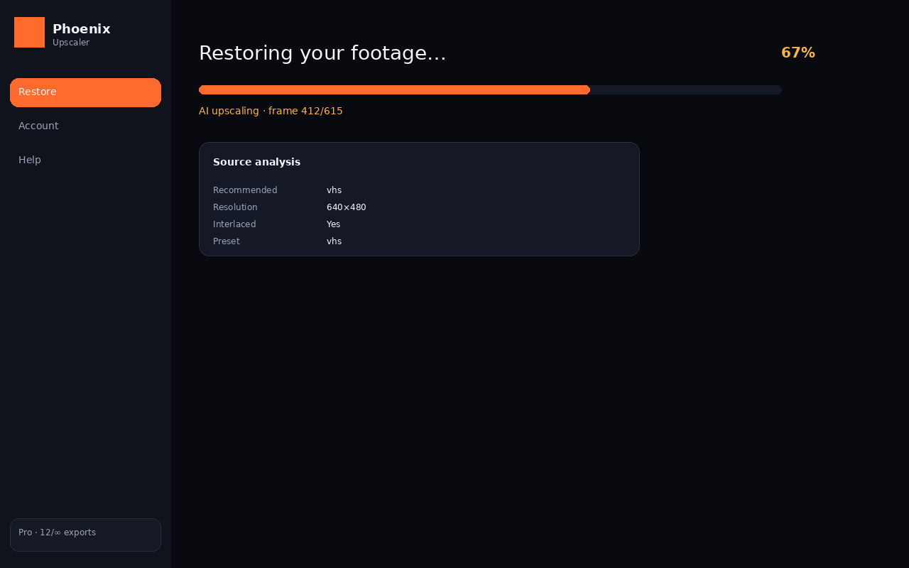
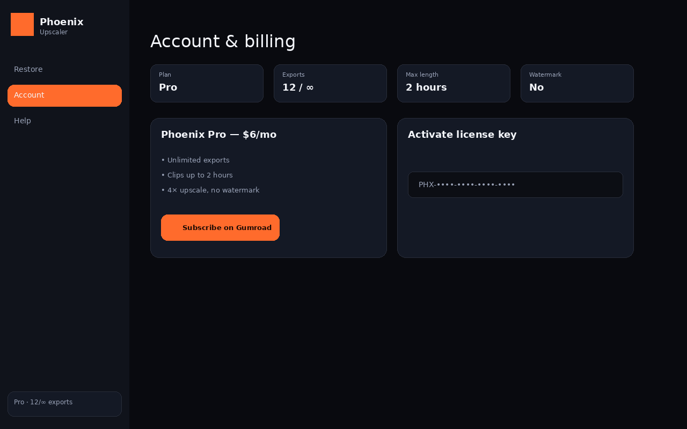

# Phoenix Upscaler

**Bring VHS tapes, camcorder footage, and old DVDs back to life — on your own computer.**

Phoenix is a desktop app built for people who care about family history, not Hollywood budgets. Drop in a clip, pick a preset, download restored video. Nothing uploads to the cloud. Ever.

**[Try it free →](https://aravindk74.github.io/phoenix-upscaler/)** · **[Get Pro ($6/mo)](https://aravindk74.gumroad.com/l/phoenixupscaler)**

---

## Why Phoenix exists

You found a box of tapes. Maybe a Michael Jackson concert rip from 1990. Maybe your parents' wedding. The footage is precious — but it's fuzzy, interlaced, and stuck at VHS quality.

The usual options hurt:

| | **Topaz Video AI** | **Adobe / cloud tools** | **Phoenix Upscaler** |
|---|---|---|---|
| **Price** | ~$299+ or ~$25/mo | Creative Cloud + extras | **$6/mo** or **$60/yr** |
| **Privacy** | Local (but pricey) | Often cloud-based | **100% local** |
| **Built for** | Pros & filmmakers | General editing | **VHS, tape, archival SD** |
| **Learning curve** | Steep | Steep | **Drag, drop, done** |
| **Subscription trap** | Expensive renewals | Locked ecosystem | Cancel anytime on Gumroad |

Phoenix is the **best-value alternative** for restoring old personal footage — without paying Topaz prices or handing your memories to a server.

---

## See it in action

Real restoration: **Michael Jackson Bad World Tour** — rare VHS archive (640×480) restored to **1080p**.

More examples on our **[official website](https://aravindk74.github.io/phoenix-upscaler/#demo)**.

---

## Download

| Platform | Installer |
|---|---|
| **Windows** | `PhoenixUpscaler-Setup.exe` — double-click, Next, done |
| **Linux** | `PhoenixUpscaler.AppImage` — chmod +x, run |
| **macOS** | `PhoenixUpscaler.dmg` — drag to Applications |

Get the latest build from **[Releases](https://github.com/aravindk74/phoenix-upscaler/releases)**.

No Python. No command line. AI models included — works offline after install.

---

## What you get

- **VHS & tape preset** — deinterlace, denoise, upscale without the plastic look
- **Film & archive preset** — keeps natural grain, lifts resolution
- **Faces preset** — interviews and home movies where people matter
- **Auto mode** — Phoenix analyzes your clip and picks the best settings
- **Live progress** — see exactly what stage you're on, frame by frame
- **Free tier** — 90-second clips, 5 exports/month (watermarked)
- **Pro** — unlimited exports, 2-hour clips, 4× upscale, all presets, no watermark

---

## Pricing

| Plan | Price | Best for |
|---|---|---|
| **Free** | $0 | Testing on a short clip |
| **Pro monthly** | $6/mo | Regular restorations |
| **Pro annual** | $60/yr | Save $12 — family archive projects |

Subscribe on **[Gumroad](https://aravindk74.gumroad.com/l/phoenixupscaler)**. License key arrives by email. Paste it in the app → Account → Activate.

Demo key for reviewers: contact us via the website.

---

## Screenshots

| Home | Processing | Account |
|---|---|---|
|  |  |  |

---

## Who Phoenix is for

- Families digitizing **VHS and camcorder tapes**
- Fans restoring **concert recordings and TV captures**
- Anyone who wants **Topaz-class results** without Topaz-class pricing
- People who refuse to **upload private footage** to the cloud

## Who Phoenix is not for

- Hollywood VFX pipelines (use Topaz + DaVinci)
- Real-time streaming upscaling
- People who need cloud rendering farms

---

## FAQ

**Is my video uploaded anywhere?**  
No. Phoenix runs entirely on your machine.

**How is this different from Topaz?**  
Topaz is excellent and worth it for professionals. Phoenix targets the same restoration problems — interlacing, noise, resolution, flicker — at a fraction of the cost, with a simpler workflow for home archives.

**What formats work?**  
MP4, MOV, MKV, AVI, and most common video files.

**Can I cancel?**  
Yes. Gumroad subscriptions cancel anytime.

---

## Official website

Full showcase, before/after demo, and download links:

**https://aravindk74.github.io/phoenix-upscaler/**

---

## Repository

This repo contains the **marketing site**, **release installers**, and **demo assets**. Application source is proprietary.

© 2026 Phoenix Upscaler. All rights reserved.